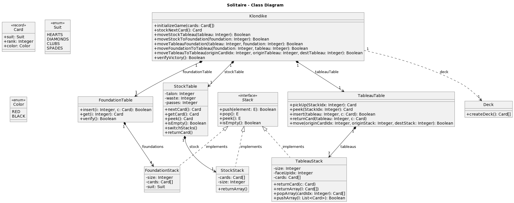

[Ignacio Demarchi (Padrón 107835)](https://github.com/IgnacioDemarchi)  
[Facundo Xu (Padrón 108295)](https://github.com/FacundoXu)

El diagrama de clases también se encuentra en la carpeta Solitario/doc junto con las reglas en las que nos basamos para el Klondike

